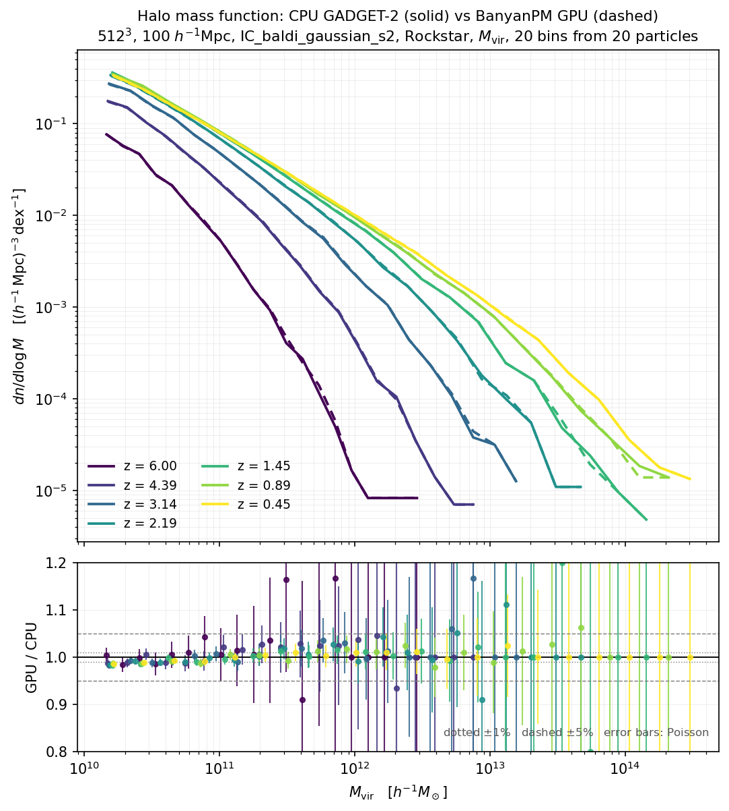

# BanyanPM

**A GADGET-2-compatible cosmological N-body code for AMD GPUs.**

BanyanPM runs collisionless cosmological simulations on a single AMD GPU using HIP/ROCm. It reads
GADGET-2 parameter files and format-1 snapshots and writes the same, so existing setups and
downstream tools — halo finders, power-spectrum codes — work unchanged.

It is built on the [Bonsai](https://github.com/treecode/Bonsai) GPU tree code, with the physics
reimplemented to follow [GADGET-2](https://wwwmpa.mpa-garching.mpg.de/gadget/): Barnes–Hut and
Springel opening criteria, spline softening, individual timesteps on a power-of-two ladder, and a
TreePM short/long-range split.

A banyan grows one crown on thousands of trunks from a single root system. `PM` is the particle
mesh.

> ### ⚠️ This code was written by an AI and has not been reviewed by a human
>
> Every line was written by **Claude (Opus, Anthropic)** working under the direction of
> [@spilipenko](https://github.com/spilipenko), through a long audit of the reference
> implementation. **No human has read the source.** The validation below is real and reproducible,
> but it is *behavioural* — it demonstrates that the code reproduces GADGET-2's results on the runs
> that were tested, not that the code is correct.
>
> Treat results as unverified. If you use this for science, check it independently first.

---

## Scope

Dark matter only. **There is no SPH, no gas, no cooling and no star formation**, and no MPI — one
GPU, one process. Gas-related parameter keys are parsed and ignored.

## Build

```bash
cmake -S . -B build \
  -DCMAKE_BUILD_TYPE=Release \
  -DPERIODIC=ON \
  -DGADGET_HIP_PMGRID=512 \
  -DMAC_SPRINGEL=ON
make -C build -j12 gadget_hip
```

`-DCMAKE_BUILD_TYPE=Release` is not optional in practice — omitting it produces a correct but far
slower binary, which has twice been mistaken for a physics regression. `MAC_SPRINGEL` must agree
with `TypeOfOpeningCriterion` in the parameter file; the binary refuses a mismatch rather than
silently substituting the criterion it was built with.

**MPI is not needed.** The solver contains no MPI references at all; only three legacy utilities
inherited from Bonsai do, and they are off by default
(`-DGADGET_HIP_BUILD_BONSAI_TOOLS=ON` builds them, and then MPI is required).

## Run

```bash
./build/gadget_hip --param run.param                                   # see examples/z0.param
./build/gadget_hip --param run.param --restart-file ckpt.bin           # with checkpointing
./build/gadget_hip --param run.param --restart-file ckpt.bin --resume  # continue
```

Writing a file named `stop` into `OutputDir` ends the run cleanly at the next step.

Output: `snapshot_NNN` (GADGET-2 format 1), `info.txt` (GADGET's per-step line), and `cpu.txt`
(cumulative per-phase timings in GADGET-2's own 18-column format, so it diffs directly against a
GADGET-2 run's file). Energies go to stdout; **no `energy.txt` is written**.

Full documentation of every build option, every `.param` key — including which are honoured and
which are parsed and ignored — and the differences from GADGET-2 is in the sections below and in
[`docs/ENVIRONMENT.md`](docs/ENVIRONMENT.md) for the runtime switches.

### GPU resets on a machine with a display attached — fixed, but read this if you see it

On a GPU that also drives a desktop, runs used to die within a few steps with
`HW Exception by GPU node-1 ... reason: GPU Hang`, and `dmesg` showed repeated GPU resets. This was
**not** a fault in the physics — it was the display stack being starved.

The tree walk was issued as **a single kernel dispatch per step covering all active groups**, and at
512³ with the Springel criterion that dispatch ran for **~7 seconds**. While it occupied the GPU
the compositor could not complete its work, so the graphics ring hit `amdgpu.lockup_timeout`
(default **2000 ms**) and the driver reset the device. The simulation was collateral damage. The
giveaway in `dmesg` is a **graphics** ring timeout immediately before each reset:

```
amdgpu: ring gfx_0.0.0 timeout, signaled seq=31272, emitted seq=31274
```

It looked like a code bug because it was reproducible, always at the same step, and specific to the
Springel criterion — but only because that criterion produces the long dispatch. Geometric opening,
or a loose `ErrTolForceAcc`, shortens the dispatch enough to fit inside the watchdog and appears to
"work", which sent the diagnosis down a blind alley for a while.

**The walk is now split into chunks of active groups**, sized adaptively from the previous step's
measured walk time, so no single launch monopolises the device. The longest dispatch at 512³ fell
from ~7300 ms to ~540 ms. If you are on an older build, or still see resets, either workaround
below is sufficient:

```bash
# 1. run without a desktop -- nothing is submitting graphics work to starve
sudo systemctl isolate multi-user.target        # ... run ...
sudo systemctl isolate graphical.target

# 2. give the rings enough headroom (Fedora; merges with existing kernel args, reboot required)
sudo grubby --update-kernel=ALL --args="amdgpu.lockup_timeout=20000,20000,20000,20000"
```

Verified: with the timeout raised, 512³ Springel at `ErrTolForceAcc=0.002` runs with a desktop
session active and zero GPU resets. Expect the desktop to be sluggish during dense steps — the GPU
really is busy.

## Zoom simulations (`PLACEHIGHRESREGION`)

A zoom run resolves one region at high resolution inside a larger, coarser box. GADGET does this
with a **second, non-periodic particle mesh** over the high-res region, on top of the periodic one;
this code now does the same.

```bash
cmake -S . -B build-zoom -DCMAKE_BUILD_TYPE=Release \
  -DPERIODIC=ON -DMAC_SPRINGEL=ON -DUNEQUAL_SOFTENINGS=ON \
  -DGADGET_HIP_HIGHRES=ON -DGADGET_HIP_PMGRID=256
./build-zoom/gadget_hip --param zoom.param --zoom-mask 0x2
```

`--zoom-mask` is GADGET's `PLACEHIGHRESREGION` bitmask — bit *t* set means particle type *t* is
high-resolution. `0x2` is the usual choice (type 1 only). `UNEQUAL_SOFTENINGS` is required whenever
the types do not share a softening, and the binary refuses the parameter file otherwise rather than
applying one type's softening to the others.

- `--zoom-enlarge` is GADGET's `ENLARGEREGION`, **default 1.2**. Stock GADGET leaves
  `ENLARGEREGION` undefined, but it sits three lines under `PLACEHIGHRESREGION` in GADGET's own
  Makefile with 1.2 filled in, so a real zoom user enables both. The cost is explicit: at fixed
  `GADGET_HIP_PMGRID` the fine cell, `Asmth[1]` and `Rcut[1]` all grow 20% and the fine mesh
  resolves 20% less. Pass `--zoom-enlarge 1.0` for the tightest fine grid.
- `--zoom-recenter` (**default on**) translates every particle at load so the high-res region sits
  at the box centre, and undoes the shift when snapshots are written, so output stays in the
  initial conditions' frame. This is a deliberate *addition*: GADGET simply refuses to run a dual
  mesh when the region crosses a periodic boundary, which forces you to pre-shift the ICs by hand
  and un-shift every snapshot during analysis. Finding the region's centre in a periodic box is not
  a naive centre of mass — it is computed by minimum image against a reference member, which is
  exact while the region's extent is under half the box and refuses rather than guesses otherwise.

**Validated against GADGET per particle.** The region geometry is a digit-for-digit match to
GADGET's own (`Asmth[1]` 0.196520, `Rcut[1]` 0.884339, data extent 14.3414, corner 10.0487), and an
instrumented GADGET dumping `GravAccel` and `GravPM` — the latter split into its coarse and fine
parts — gives, on the same 113k-particle zoom at `PMGRID=128`:

| force component | rms difference / \|a_total\| | max |
|---|---|---|
| coarse mesh (periodic) | 2.04e-06 | 4.27e-04 |
| **fine mesh (the zoom grid)** | **1.85e-06** | 1.18e-04 |
| total, high-res particles | 9.29e-04 | 2.06e-02 |

Both meshes agree to float32 round-off. The total on high-res particles is *closer* to GADGET's
production criterion than GADGET's own two opening criteria are to each other (6.19e-03), which is
the right yardstick because it contains none of this code.

Over a full run (`a = 0.02 → 0.5`, 2,709 steps) against a CPU GADGET-2 reference: kinetic and
potential energy within **±0.42%** at all 24 epochs, type-1 `sigma(delta)` within 1.7%, and the
target halo — matched by particle ID, since a halo's position is not reproducible across codes but
its membership is — centred to **0.005–0.007 Mpc/h**, 2–3% of the mean interparticle spacing, with
enclosed mass within 1% outside 0.1 Mpc/h.

**Mesh size.** Measured at 115M particles, per step over matched 10-step runs:

| PMGRID | every-step PM | with `GADGET_HIP_PM_CADENCE=1` |
|---|---|---|
| 128 | 4.325 s | **2.673 s** |
| 256 | **3.491 s** | **2.677 s** |
| 512 | 4.565 s | 3.784 s |

Recomputing every step, the cost has a genuine minimum in the middle rather than falling with
resolution: 128 is bound by the coarse mass assignment (115M particles into 128³ is 55 per cell, so
the atomic adds collide constantly) and 512 by the fine-mesh FFT, which is **1024³** because the
zoom mesh is doubled for zero padding. With the cadence on, 128 and 256 become indistinguishable —
on a non-PM step neither does any coarse-mesh work — so 256 is the finer of two equals. Peak memory
agrees: 31 GB against 512's 47 GB.

Both meshes now follow the cadence together, as GADGET does — `accel.c` wraps the whole of
`long_range_force()`, which solves both. Before that the fine mesh was solved every step regardless
(measured: coarse 1 solve in 10 steps, fine 10 of 10), which cost 1.59 s/step at `PMGRID=512` and
was the whole of why 512 looked slower. With it fixed all three mesh sizes cost the **same** between
PM steps — 2.194 / 2.198 / 2.214 s for 512 / 256 / 128, within 0.9% — and on the periodic steps
where the timestep ladder brings a large fraction of particles up at once, the cheaper tree walk at
small `Rcut` makes **512 the fastest overall** (2.615 s against 256's 2.708 and 128's 2.846).

So with the cadence on, pick 512 for the finest mesh; memory is the only argument against it (47 GB
against 256's 31 GB). Without the cadence, pick 256.

Validated, because deferring the fine force changes the dynamics: on the 113k zoom against the CPU
reference, worst kinetic-energy deviation is **+0.411%** against every-step's +0.435%, and the
ID-matched halo centre lands 0.0094 Mpc/h from the reference against 0.0066 — both unchanged within
noise. The *reported potential* energy is a different matter: see the cadence bullet under
[Differences from GADGET-2](#differences-from-gadget-2).

Only the 113k zoom above is validated against GADGET; the 115M run is exercised for performance and
stability, not accuracy, as no CPU reference for it exists.

---

## Validation

Against a CPU GADGET-2 reference run on identical initial conditions: 512³ particles, 100 Mpc/h
box, ΛCDM (Ωm = 0.307, ΩΛ = 0.693, h = 0.678), z = 99 → 0, Springel opening criterion with
`ErrTolForceAcc = 0.002`, PMGRID 512.

**Energy.** Kinetic energy at all 20 statistics epochs, worst deviation **+0.145%** (at a = 0.26),
with no trend — +0.101% at a = 0.91 and +0.064% at a = 0.96.

**Halo mass function** at z = 0, both catalogues built by the same Rockstar binary with the same
configuration:

| | CPU GADGET-2 | BanyanPM |
|---|---|---|
| haloes | 309,610 | 306,957 (−0.86%) |
| N(> 10¹³·⁵) | 119 | 119 |
| N(> 10¹⁴) | 24 | 24 |
| N(> 10¹⁴·⁵) | 4 | 4 |
| mass-function ratio, median over 20 bins | — | 0.9984 |

**Individual haloes.** Matching the 100 most massive one-to-one: median mass difference **0.26%**,
median position offset **0.0089 Mpc/h** — about 1/22 of the mean interparticle spacing. 88 of 100
agree within 1%; the handful of percent-level outliers are merger-timing differences, which is
ordinary between two independent codes.

**Force accuracy.** 0.39% rms on the fine-particle force against the same reference. A sharper,
per-component check — against an instrumented GADGET dumping each particle's short-range and
long-range force separately — is in [Zoom simulations](#zoom-simulations-placehighresregion) above;
it is what caught the `Rcut` pruning defect described there.

**Halo mass function across redshift.** A second run of the same ICs on the integer-timeline build,
compared against the CPU reference at all seven epochs where the two output schedules coincide.
Rockstar catalogues on both sides, 20 bins from the 20-particle mass (1.27e10 M⊙/h) upward; haloes
are matched only when a counterpart agrees in **both** position and mass:

| z | N(>20 p) GPU/CPU | N(>100 p) GPU/CPU | matched | median offset | mass bias |
|---|---|---|---|---|---|
| 6.00 | 0.9989 | 1.0199 | 98.86% | 0.0144 | +0.79% |
| 4.39 | 0.9934 | 1.0060 | 98.64% | 0.0151 | +0.81% |
| 3.14 | 0.9918 | 1.0051 | 98.32% | 0.0156 | +0.64% |
| 2.19 | 0.9906 | 1.0008 | 98.21% | 0.0153 | +0.44% |
| 1.45 | 0.9902 | 0.9998 | 98.32% | 0.0154 | +0.30% |
| 0.89 | 0.9908 | 0.9990 | 98.37% | 0.0152 | +0.20% |
| 0.45 | 0.9907 | 0.9999 | 98.53% | 0.0152 | +0.23% |



Offsets in Mpc/h. No mass bin deviates by more than 3σ Poisson at any epoch, and at z = 0.45 the
eight most massive bins reproduce the CPU counts *exactly* (300, 99, 43, 22, 8, 4, 3). The median
halo offset is flat at **15 kpc/h** across a factor of five in expansion factor — it does not grow,
even though individual particle trajectories diverge chaotically (rms 6e-2 Mpc/h between two runs
of the same binary). The residual ~0.9% deficit is confined to the 20–100 particle resolution
limit; above 100 particles the catalogues agree to 3 haloes in 58,240.

**Restart.** Stopping a run and resuming from a checkpoint reproduces the uninterrupted run to
within the PM-atomics noise floor — verified by comparing the stop/resume divergence against a
control of two *uninterrupted* runs of the same binary, which agree no better (median 6.98e-4 vs
6.71e-4 Mpc/h, rms 6.02e-2 vs 6.02e-2).

Note that this validates dark-matter-only, periodic, TreePM runs at one resolution. Nothing else
has been tested.

## Performance

Same problem, same machine class — 512³ to z = 0, AMD Strix Halo (gfx1151) against 16 CPU cores:

| | wall clock | per step |
|---|---|---|
| CPU GADGET-2, 16 cores | 48.3 h | 18.20 s |
| BanyanPM | **8.7 h** | **3.38 s** |
| | **5.6× faster** | |

Both runs were 9,200–9,600 steps. The gain is concentrated at late times, where clustering makes
the mesh assignment expensive; early steps are roughly at parity.

That wall clock was measured on the float-timeline build. Full z = 0 runs on the integer timeline
have since been timed, with the PM cadence on:

| 512³ to z = 0 | steps | wall clock | per step |
|---|---|---|---|
| cadence | 9,538 | 7.9 h | 2.98 s |
| GADGET-2, 16 CPU cores | 9,557 | 48.3 h | 18.20 s |

The step counts agree to **0.2%**, which is the sharper of the two validations: the timestep
criterion is built from the same force GADGET builds it from, so the two codes subdivide time nearly
identically rather than merely arriving at the same place.

A per-phase breakdown of any run is in its `cpu.txt`. On a late step the cost is dominated by the
tree walk on dense steps (~47%) and by the tree rebuild otherwise (~40%) — the long-range force is
about 20%.

---

## Invariants the compiler enforces

The hardest bugs in this codebase shared one shape: *a quantity is correct where it is stored, and a
transformation is applied to it on only one of several paths to where it is used.* The run completes,
the exit status is zero, and the numbers are plausible. Four such invariants are now types rather
than comments, so the mistake does not compile.

| header | what it makes impossible |
|---|---|
| `include/gadget_units.h` | Using a G-free acceleration as if G had been applied. The tree and the mesh both produce G-free forces and G is applied once downstream; three separate code paths reached a consumer without meeting it, each time silently. |
| `include/gadget_index_spaces.h` | Indexing a particle buffer with the wrong index. Buffers live in up to three index spaces at once and all are `uint`-shaped, so every wrong pairing was in range and plausible; group arrays are a fourth space, and shorter. |
| `include/devFunctionDefinitions.h` | A kernel declaration drifting from its definition. These declarations are used only for their address, so a wrong signature compiled and ran silently — 25 of them had diverged, one declaring 12 parameters against 25 real ones. |
| `include/buffer_registry.h` | Guessing which index space a buffer is in: it is recorded as data, with the evidence for each entry. |

A buffer's index space depends on where in the step you are, so the type is on the **kernel
parameter** — declared by whoever knows the phase — not on the buffer.

## Testing

`tests/gate64/gate64.sh <binary>` runs five 64³ boxes to z = 0 against a stored CPU GADGET-2
reference in about four minutes. It checks energy at 20 epochs against GADGET-2 *and* against this
code's own known-good envelope, structure growth at z = 0, two configurations that **must** differ,
and that no optional feature silently declined to engage. It finishes by reproducing a known-bad
configuration and failing if any check accepts it — a gate nobody has seen fail is not a gate. Every
threshold in it is a measured noise floor, documented with the measurement in
[`tests/gate64/README.md`](tests/gate64/README.md).

`tests/zoom/run.sh` covers the zoom path's host-side geometry — chiefly that the periodic centring
is exact when it claims to be and refuses when it cannot be, which is the part a wrong answer would
silently mis-place the whole fine mesh by.

---

## Differences from GADGET-2

Read this before trusting a comparison. Items marked **open** are known gaps, not design choices.

- **Dark matter only**, single GPU, single process.
- **Monopole tree**, matching GADGET-2. Bonsai's quadrupole correction is available but off.
- **The long-range force follows GADGET's cadence**, opt-in with `GADGET_HIP_PM_CADENCE=1`. PM is
  solved only on PM steps, the interval is chosen on the integer timeline the way GADGET chooses it
  (the largest power-of-two tick count not exceeding `dt_displacement`), and the stored force is
  applied as a *separate kick over the PM interval, midpoint to midpoint, to every particle exactly
  once*. Measured at 512³ to z = 0: **439 PM solves against GADGET's 438**, worst kinetic-energy
  deviation **0.142%**, and about **17% less wall clock** than recomputing every step. Every-step remains
  the default, but "because it is newer" has stopped being a reason -- the measured cost is 0.133%
  in worst-case kinetic energy, and on a zoom run the cadence is worth 17-38% of the step depending
  on mesh size. Turning it on is reasonable; the default has simply not been revisited.

  Both meshes follow the cadence, as in GADGET. (The fine mesh used not to: it was solved every
  step while the coarse one was not, costing up to 42% of a zoom step. Fixed by accumulating it into
  the same long-range arrays the coarse mesh writes, which is how GADGET's `long_range_force()` does
  it and which hands the fine mesh the separate kick, the energy drift correction and the `aold`
  contribution in one move.)

  **One real caveat with the cadence on: the reported `Epot` is a sawtooth** — worst −2.2% against
  the CPU reference, where every-step PM is −0.28%. GADGET recomputes the long-range potential fresh
  at statistics time (`run.c:55` → `compute_potential()` → `pmpotential_periodic()`), independent of
  the PM cadence; this code reads it from the once-per-interval store. It is **diagnostic only** —
  `Epot` is reported but never integrated, and the kinetic energy, the halo positions and the halo
  masses are all unaffected — but it means `Epot` cannot be used to validate a cadence run.
  **Open.**

  The obvious shortcut — keeping the stored force but folding it into each active particle's own
  kick — looks equivalent and is not: it cost 11% in kinetic energy and was withdrawn. Two further
  consumers of the long-range force had to be corrected before the cadence agreed with GADGET: the
  energy diagnostic, which GADGET drift-corrects back to the current time (`global.c:79-87`;
  without it the reported energy is a sawtooth of up to 2% that looks exactly like a dynamics bug),
  and the opening criterion's `OldAcc`, which GADGET builds from tree **and** PM
  (`gravtree.c:309-311`).
- **The short-range cutoff is pruned per axis**, as GADGET prunes it
  (`forcetree.c:1583-1605`), rather than on a sphere. This was a real defect until recently: a
  Euclidean test cuts diagonal neighbours at `Rcut` where GADGET's per-axis box reaches
  `sqrt(3)·Rcut`, and because *neither* code applies a hard per-particle `r > Rcut` cut — both rely
  on the erfc table running out at `6·Asmth` — the pruning geometry alone decided whether a pair
  just past `Rcut` was evaluated. The two directions are not symmetric: the mesh independently
  supplies every pair's long-range complement, so evaluating an extra far pair is wasted work, while
  *omitting* one loses that force outright. The sphere was omitting them, for about 1% of low-res
  particles, by 18% of their short-range force. Fixed; the cost was 3.2% on the tree walk.
- **The tree is rebuilt every step.** GADGET rebuilds at `TreeDomainUpdateFrequency` and drifts node
  centres of mass in between. **Open**, and the largest remaining cost.
- **Integer timeline**, as in GADGET-2. Step boundaries are stored as integer ticks on a 2²⁸
  lattice spanning `log(a)` from `TimeBegin` to `TimeMax`, so a sync point is exact rather than the
  nearest representable float32, and the step ladder is a true power-of-two hierarchy. This
  replaced a float32 clock whose rounding produced phantom sub-ULP steps — on a zoom test the step
  count fell from 68,780 to ~2,710 against GADGET-2's 2,690. Restart files carry a version tag and
  a build refuses to read the older float layout rather than reinterpret it.
- **Not bit-reproducible.** PM mass assignment uses `atomicAdd` on float, so the density grid
  differs in the last bits between runs and the FFT spreads that across the box. The difference is
  already present in the **first force evaluation** and is then amplified chaotically.

  Measured over four runs of one binary at 64³: **0.42% in kinetic energy by z = 0, and ±40 in step
  count.** Attributed to PM by measurement rather than suspicion — excluding the long-range force
  from the dynamics drops the run-to-run spread to 0.0021%, so PM contributes about **157×**
  everything else combined. A single run at that resolution is therefore not a measurement: average
  several, or test a signature noise cannot fake. Any acceptance tolerance must exceed this floor,
  because one tighter than it fails at random.
- **I/O**: GADGET-2 format 1 only; one file per snapshot. `energy.txt` and `timings.txt` are not
  written — energies go to stdout instead. `info.txt` and `cpu.txt` *are* written, both in
  GADGET's own format. Checkpointing uses its own format, not GADGET restart files.
- Unsupported parameter keys: `TreeDomainUpdateFrequency`, `TypeOfTimestepCriterion`,
  `NumFilesPerSnapshot`, and all SPH keys.
- **`OutputListOn`/`OutputListFilename` are now honoured.** Snapshot times are read from the file,
  filtered to `[TimeBegin, TimeMax]`, sorted, and de-duplicated, exactly as GADGET does; entries
  outside the run are normal rather than an error. Two differences, both toward saying something:
  GADGET silently stops reading at 500 entries, this warns instead; and if the list cannot be read
  or holds nothing in range the run stops rather than falling back to `TimeBetSnapshot`.

  One caveat for snapshot-by-snapshot comparisons: GADGET drifts to the output time before writing
  and lands within 1e-8 of it, while this code writes at the step that *crossed* the time,
  overshooting by one system step — up to 1.6e-3 in `a` on the run it was checked against. The
  epoch error is reported per snapshot. Reduce `MaxSizeTimestep` if tighter output epochs matter.
  **Open**, and the fix is a drift-to-output.

---

## Licence and attribution

**GPL-3.0-or-later.** See [`LICENSE`](LICENSE) and [`NOTICE`](NOTICE).

- **[Bonsai](https://github.com/treecode/Bonsai)** (Bédorf, Gaburov & Portegies Zwart) is
  Apache-2.0 and is the code this is built on — tree construction, the warp-cooperative traversal,
  the device memory layer and the program skeleton. Apache-2.0 material may be combined into a
  GPLv3 work, which is why GPLv3 and not GPLv2.
- **[GADGET-2](https://wwwmpa.mpa-garching.mpg.de/gadget/)** (Volker Springel) is GPL v2 **or
  later** and is the reference implementation the physics follows and is validated against. Source
  locations are cited throughout the code comments.

**Volker Springel and the Bonsai authors are not involved in this project and do not endorse it.**
The name deliberately avoids both projects' names for that reason. "GADGET-2-compatible" is a
statement about file formats and reproduced results, nothing more.

## Authorship

Written by **Claude (Opus, Anthropic)**, directed by [@spilipenko](https://github.com/spilipenko).

The work was done as a contract-based audit: the port's behaviour was compared against GADGET-2
clause by clause, each discrepancy recorded as a numbered contract or ticket, and each fix required
a positive control — an instrument that cannot be made to fail has not been validated. Several
findings are recorded with the failed reasoning that preceded them, because the failure mode is
usually the reusable part.

See the disclaimer at the top: **no human has read this source code.**
